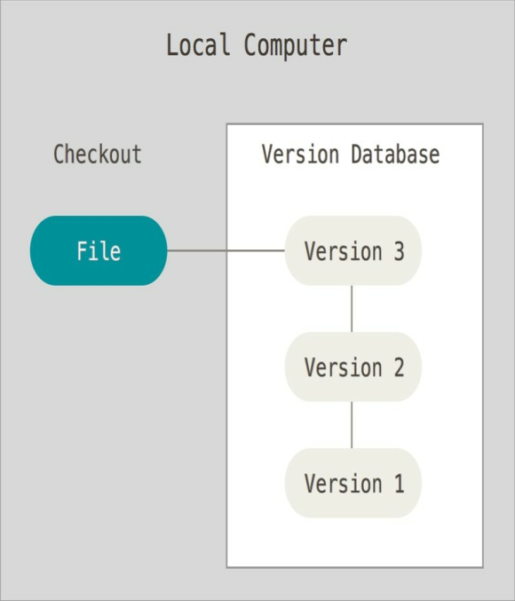
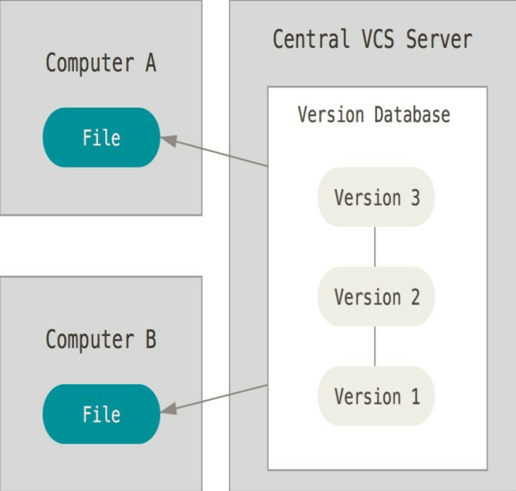
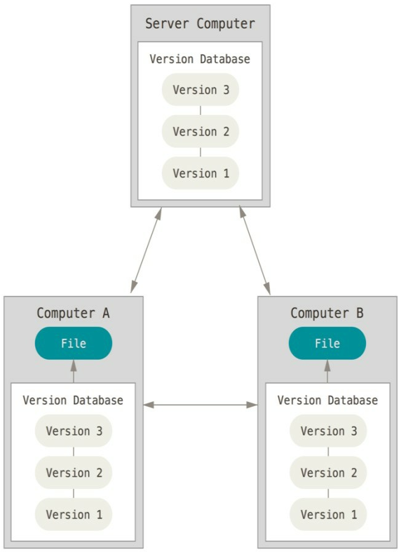
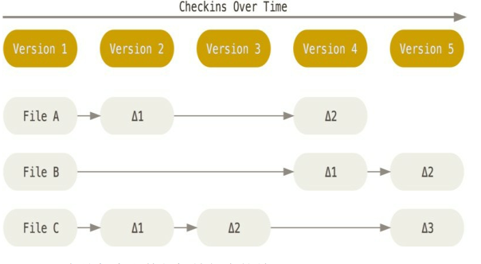
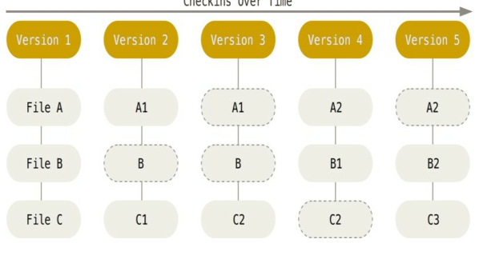

# 第 1 章 起步

>版本控制系统（VCS）

## 本地版本控制系统
用复制整个项目目录的方式来保存不同的版本



---

## 集中化的版本控制系统（Centralized Version Control Systems， 简称 CVCS）
单一的集中管理的服务器，保存所有文件的修订版本， 而协同工作的人们都通过客户端连到这台服务器， 取出最新的文件或者提交更新。 



优点： 在一定程度上看到项目中的其他人正在做些什么。 而管理员也可以轻松掌控每个开发者的权限，比在各个客户端上维护本地数据库来得轻松容易。

缺点： 如果中心数据库所在的磁盘发生损坏，将丢失所有数据——包括项目的整个变更历史，只剩下人们在各自机器上保留的单独快照。 

---

## 分布式版本控制系统（Distributed Version Control System， 简称 DVCS）

客户端并不只提取最新版本的文件快照， 而是把代码仓库完整地镜像下来。 这么一来， 任何一处协同工作用的服务器发生故障， 事后都可以用任何一个镜像出来的本地仓库恢复。 因为每一次的克隆操作， 实际上都是一次对代码仓库的完整备份。



---

>Git 在保存和对待各种信息的时候与其它版本控制系统有很大差异， 尽管操作起来的命令形式非常相近

## 直接记录快照， 而非差异比较

大部分系统以文件变更列表的方式存储信息. 它们保存的信息看作是一组基本文件和每个文件随时间逐步累积的差异。



Git 更像是把数据看作是对小型文件系统的一组快照。 每次你提交更新， 或在 Git 中保存项目状态时，它主要对当时的全部文件制作一个快照并保存这个快照的索引。 为了高效， 如果文件没有修改， Git 不再重新存储该文件， 而是只保留一个链接指向之前存储的文件。 



---


## 近乎所有操作都是本地执行

>在 Git 中的绝大多数操作都只需要访问本地文件和资源， 一般不需要来自网络上其它计算机的信息。

要浏览项目的历史，Git 不需外连到服务器去获取历史，然后再显示出来——它只需直接从本地数据库中读取。 你能立即看到项目历史。 如果你想查看当前版本与一个月前的版本之间引入的修改，Git 会查找到一个月前的文件做一次本地的差异计算，而不是由远程服务器处理或从远程服务器拉回旧版本文件再来本地处理。这也意味着你离线或者没有 VPN 时， 几乎可以进行任何操作。 

---


## Git 保证完整性

>Git 中所有数据在存储前都计算校验和， 然后以校验和来引用。 Git数据库中保存的信息都是以文件内容的哈希值来索引，而不是文件名。

这意味着不可能在 Git 不知情时更改任何文件内容或目录内容。 这个功能建构在 Git 底层， 是构成 Git 哲学不可或缺的部分。 若你在传送过程中丢失信息或损坏文件， Git 就能发现。Git用以计算校验和的机制叫做 SHA-1 散列（hash， 哈希） 。 这是一个由 40 个十六进制字符（0-9 和 a-f） 组成字符串， 基于 Git 中文件的内容或目录结构计算出来。 SHA-1 哈希看起来是这样：
```bash
24b9da6552252987aa493b52f8696cd6d3b00373
```

---

## Git 一般只添加数据

你执行的 Git 操作， 几乎只往 Git 数据库中增加数据。 很难让 Git执行任何不可逆操作， 或者让它以任何方式清除数据。 同别的VCS 一样， 未提交更新时有可能丢失或弄乱修改的内容； 但是一旦你提交快照到 Git 中， 就难以再丢失数据， 特别是如果你定期的推送数据库到其它仓库的话。

---


## 三种状态

>Git 有三种状态， 你的文件可能处于其中之一： 已提交（committed） 、 已修改（modified） 和已暂存（staged）。

1. **已提交** 表示数据已经安全的保存在本地数据库中。 
2. **已修改** 表示修改了文件， 但还没保存到数据库中。 
3. **已暂存** 表示对一个已修改文件的当前版本做了标记， 使之包含在下次提交的快照中。

> Git 项目的三个工作区域的概念： Git 仓库、 工作目录以及暂存区域。


**Git 仓库目录** 是 Git 用来保存项目的元数据和对象数据库的地方。这是 Git 中最重要的部分， 从其它计算机克隆仓库时， 拷贝的就是这里的数据。

**工作目录** 是对项目的某个版本独立提取出来的内容。 这些从 Git 仓库的压缩数据库中提取出来的文件， 放在磁盘上供你使用或修改。

**暂存区域** 是一个文件， 保存了下次将提交的文件列表信息， 一般在Git 仓库目录中。 有时候也被称作"索引"， 不过一般说法还是叫暂存区域。

Git 工作流程如下：
1. 在工作目录中修改文件。 
2. 暂存文件， 将文件的快照放入暂存区域。
3. 提交更新， 找到暂存区域的文件， 将快照永久性存储到 Git 仓库目录。 

>1. 如果自上次取出后， 作了修改但还没有放到暂存区域， 就是已修改状态。 
>2. 如果作了修改并已放入暂存区域， 就属于已暂存状态。 
>3. 如果 Git 目录中保存着特定版本文件， 就属于已提交状态。 

---


## 命令行

原生的命令行模式， GUI 模式

---

## 安装 Git

---

## 初次运行 Git 前的配置

1. `/etc/gitconfig` 文件: 包含系统上每一个用户及他们仓库的通用配置。 如果使用带有 --system 选项的 git config 时， 它会从此文件读写配置变量，此文件中的设置 **_优先级最低_** 。
2. `~/.gitconfig` 或 `~/.config/git/config` 文件： 只针对当前用户。 可以传递 `--global` 选项让 Git 读写此文件。
3. 当前使用仓库的 Git 目录中的 config 文件（就是`.git/config` ） ： 针对该仓库，可使用 --file选项修改，是Git的默认选项，此文件中的设置具有 **_最高优先级_** 。  

>每一个级别覆盖上一级别的配置， 所以 `.git/config` 的配置变量会覆盖 `/etc/gitconfig` 中的配置变量。 在 Windows 系统中， Git 会查找 $HOME 目录下（一般情况下是 C:\Users\$USER ）的`.gitconfig` 文件。 Git 同样也会寻找`/etc/gitconfig` 文件， 但只限于 `MSys` 的根目录下， 即安装 Git 时所选的目标位置。

>`/etc/gitconfig`, `C:\Users\zhuoyiliang\.gitconfig`, 项目上的`.git/config`

---

## 用户信息

每一个 Git 的提交都会使用这些信息， 并且它会写入到你的每一次提交中， 不可更改：

```bash
$ git config --global user.name "John Doe"
$ git config --global user.email johndoe@example.com
```

当你想针对特定项目使用不同的用户名称与邮件地址时， 可以在那个项目目录下运行没有 --global 选项的命令来配置。

---

## 文本编辑器

>如果未配置， Git 会使用操作系统默认的文本编辑器， 通常是 Vim (Linux)

Mac 使用  Emacs 文本编辑器

```bash
$ git config --global core.editor emacs
```

Windows下 设置git默认的文本编辑器

>设置window下默认的文本编辑器为`nodepad++`

```bash
$ git config --global core.editor "D:\nodpad++\Notepad++\notepad++.exe"  
```

---

## 检查配置信息

>可能会看到重复的变量名， 因为 Git 会从不同的文件中读取同一个配置（例如： `/etc/gitconfig` 与 `~/.gitconfig` ） 。 这种情况下， Git会使用它找到的每一个变量的最后一个配置。

所有
```bash
$ git config --list
user.name=John Doe
user.email=johndoe@example.com
color.status=auto
color.branch=auto
color.interactive=auto
color.diff=auto
...
```

某一
```bash
$ git config user.name
```

---

## 获取帮助

1. $ git help <verb>
2. $ git <verb> --help
3. $ man git-<verb>

config 命令的手册
```bash
$ git help config
```

---

## SSH keys配置

检查电脑上是否有SSH Key

```bash
~/.ssh
```

创建`ssh key`

```bash
ssh-keygen -t rsa -C "邮箱"
```

>输入用于保存`SSH key `代码的文件名。建议不输，直接回车。会默认生成`id_rsa`和`id_rsa.pub`两个秘钥文件。创建好`.ssh`文件夹后会提示输入两次密码（防止输错），实际上建议不输入密码，直接回车两次。

`~/.ssh` 或者`~/.ssh ls`来验证

添加SSH Key到GitHub

Settings -> SSH and `GpG keys`

验证 
```bash
ssh -T git@github.com
```

---

## 建立本地和远程连接

>在`github`上创建一个仓库

方法一： 在命令行上创建一个新的存储库

```bash
echo "# ProGit2" >> README.md
git init
git add README.md
git commit -m "first commit"
git branch -M main
git remote add origin git@github.com:zhuoyiliang/ProGit2.git
git push -u origin main
```

方法二： 从命令行推送一个现有的存储库

```bash
git remote add origin git@github.com:zhuoyiliang/ProGit2.git
git branch -M main
git push -u origin main
```

方法三： 从另一个存储库导入代码
`可以使用Subversion、Mercurial或TFS项目中的代码初始化此存储库。`