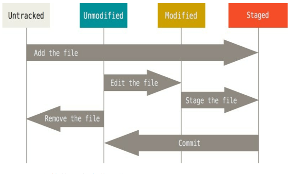

# /第 2 章 Git基础

>学习完本章之后， 你应该能够配置并初始化一个仓库（repository） 、 开始或停止跟踪（track） 文件、 暂存（stage） 或提交（commit)更改。 本章也将向你演示如何配置 Git 来忽略指定的文件和文件模式、 如何迅速而简单地撤销错误操作、 如何浏览你的项目的历史版本以及不同提交（commits） 间的差异、 如何向你的远程仓库推送（push） 以及如何从你的远程仓库拉取（pull） 文件。

## 获取 Git 仓库

1. 在现有项目或目录下导入所有文件到 Git 中;
2. 从一个服务器克隆一个现有的 Git仓库。

---

## 在现有目录中初始化仓库

如果你打算使用 Git 来对现有的项目进行管理， 你只需要进入该项目目录并输入：
```bash
$ git init
```
>该命令将创建一个名为 .git 的子目录， 这个子目录含有你初始化的 Git 仓库中所有的必须文件， 这些文件是 Git 仓库的骨干。 但是， 在这个时候， 我们仅仅是做了一个初始化的操作， 你的项目里
的文件还没有被跟踪。 

如果你是在一个已经存在文件的文件夹（而不是空文件夹） 中初始化 Git 仓库来进行版本控制的话， 你应该开始跟踪这些文件并提交。
`git add` 命令来实现对指定文件的跟踪， 然后执行`git commit` 提交：
```bash
$ git add *.c
$ git add LICENSE
$ git commit -m 'initial project version'
```

---

## 克隆现有的仓库

比如， 要克隆 Git 的可链接库 libgit2， 可以用下面的命令：
```bash
$ git clone https://github.com/libgit2/libgit2
```
自定义本地仓库的名字， 你可以使用如下命令：
```bash
$ git clone https://github.com/libgit2/libgit2 mylibgit
```

---

## 记录每次更新到仓库

>工作目录下的每一个文件都不外乎这两种状态：已跟踪或未跟踪。 已跟踪的文件是指那些被纳入了版本控制的文件， 在上一次快照中有它们的记录， 在工作一段时间后，它们的状态可能处于 **_未修改_** ， **_已修改_** 或 **_已放入暂存区_**。



---

## 检查当前文件状态

```bash
$ git status
On branch master
nothing to commit, working directory clean
```

>分支名是 `master`

```bash
$ git init
$ echo 'My Project' > README
$ git status
On branch master
Untracked files:
(use "git add <file>..." to include in what will be committed)
README
nothing added to commit but untracked files present (use "git add" to track)
```
>未跟踪的文件意味着 Git 在之前的快照（提交） 中没有这些文件； Git 不会自动将之纳入跟踪范围。

---

## 跟踪新文件

跟踪 README 文件， 运行：
```bash
$ git add README
```
再运行 git status 命令， 会看到 README 文件已被跟踪， 并处于暂存状态：
```bash
$ git status
On branch master
Changes to be committed:
(use "git reset HEAD <file>..." to unstage)
new file: README
```
>只要在 `Changes to be committed`说明是已暂存状态。如果此时提交，那么该文件此时此刻的版本将被留存在历史记录中。使用 git init 后就运行了 git add (files) 命令，开始跟踪当前目录下的文件。 git add 命令使用文件或目录的路径作为参数； 如果参数是目录的路径， 该命令将递归地跟踪该目录下的所有文件。

---

## 暂存已修改文件

>Changes not staged for commit 这行下面， 说明已跟踪文件的内容发生了变化， 但还没有放到暂存区。 要暂存这次更新， 需要运行 git add 命令。 这是个多功能命令： 可以用它开始跟踪新文件， 或者把已跟踪的文件放到暂存区， 还能用于合并时把有冲突的文件标记为已解决状态等。 将这个命令理解为“添加内容到下一次提交中”而不是“将一个文件添加到项目中”要更加合适。

>Git 只不过暂存了你运行 git add 命令时的版本，运行了 git add 之后又作了修订的文件， 需要重新运行 git add 把最新版本重新暂存起来

---

## 状态简览

`git status -s` 命令或 `git status --short` 命令
```bash
$ git status -s
M README
MM Rakefile
A lib/git.rb
M lib/simplegit.rb
?? LICENSE.txt
```

>新添加的未跟踪文件前面有 ?? 标记， 新添加到暂存区中的文件前面有 A 标记， 修改过的文件前面有 M 标记。出现在右边的 M 表示该文件被修改了但是还没放入暂存区， 出现在靠左边的 M 表示该文件被修改了并放入了暂存区。

---

## 忽略文件

```bash
$ cat .gitignore
*.[oa]
*~
```
>第一行告诉 Git 忽略所有以 .o 或 .a 结尾的文件,一般这类对象文件和存档文件都是编译过程中出现的。
>第二行告诉 Git 忽略所有以波浪符（`~`） 结尾的文件， 许多文本编辑软件（比如 Emacs） 都用这样的文件名保存副本。

>GitHub 有一个十分详细的针对数十种项目及语言的 `.gitignore`文件列表， 你可以在 https://github.com/github/gitignore 找到它


---

## 查看已暂存和未暂存的修改

`git diff` 将通过文件补丁的格式显示具体哪些行发生了改变要查看尚未暂存的文件更新了哪些部分， 不加参数直接输入 `git diff` ：
> git diff 本身只显示尚未暂存的改动， 而不是自上次提交以来所做的所有改动。 
```bash
$ git diff
```

查看已暂存的将要添加到下次提交里的内容， 可以用 `git diff --cached` , 或(Git 1.6.1 及更高版本)`git diff --cached` 命令

```bash
$ git diff --cached
```

Note Git Diff 的插件版本

> 如果你喜欢通过图形化的方式或其它格式输出方式的话， 可以使用 `git difftool` 命令来用 `Araxis` ， `emerge` 或 `vimdiff` 等软件输出 diff 分析结果。 使用 `git difftool --tool-help` 命令来看你的
系统支持哪些 Git Diff 插件

---

## 提交更新

Git 工作流程如下：
1. 在工作目录中修改文件。 
2. 暂存文件， 将文件的快照放入暂存区域。
3. 提交更新， 找到暂存区域的文件， 将快照永久性存储到 Git 仓库目录。 

先用 git status 看下，是不是都已暂存起来了， 然后再运行提交命令 git commit 

```bash
$ git commit
```

将你所做的改变的 diff 输出放到编辑器中

```bash
$ git commit -v
```

将提交信息与命令放在同一行

```bash
git commit -m "Story 182: Fix benchmarks for speed"
```

>提交时记录的是放在暂存区域的快照。 任何还未暂存的仍然保持已修改状态， 可以在下次提交时纳入版本管理。 每一次运行提交操作， 都是对你项目作一次快照， 以后可以回到这个状态， 或者进行比较。

---

## 跳过使用暂存区域

自动把所有已经跟踪过的文件暂存起来一并提交， 从而跳过 git add 步骤：

```bash
$ git status
```

---

## 移除文件

>要从 Git 中移除某个文件， 就必须要从已跟踪文件清单中移除（确切地说， 是从暂存区域移除） ， 然后提交。

从工作目录中删除指定的文件

```bash
$ rm PROJECTS.md
```

>会在 “Changes not staged for commit” 部分（也就是 未暂存清单 ）出现

运行 git rm 记录此次移除文件的操作：

```bash
$ git rm PROJECTS.md
```

>如果删除之前修改过并且已经放到暂存区域的话， 则必须要用强制删除选项 -f（译注： 即 force 的首字母） 。

>让文件保留在磁盘， 但是并不想让 Git 继续跟踪。 当你忘记添加`.gitignore` 文件， 不小心把一个很大的日志文件或一堆 .a 这样的编译生成文件添加到暂存区时， 这一做法尤其有用。 为达到这一目的， 使用 --cached 选项：

```bash
$ git rm --cached README
```

删除 log/ 目录下扩展名为 .log 的所有文件

```bash
$ git rm log/\*.log
```

删除以 ~ 结尾的所有文件

```bash
$ git rm \*~
```

---

## 移动文件

文件改名：

```bash
$ git mv file_from file_to
```

相当于
```bash
$ mv README.md README
$ git rm README.md
$ git add README
```

---

## 查看提交历史

按提交时间列出所有的更新，最近的更新排在最上面。

```bash
$ git log
```

显示最近两次提交：
>附带了每次 commit 的变化

```bash
$ git log -p -2
```

每次提交的简略的统计信息
>列出额所有被修改过的文件、 有多少文件被修改了以及被修改过的文件的哪些行被移除或是添加了,在每次提交的最后还有一个总结

```bash
$ git log --stat
```


指定使用不同于默认格式的方式展示提交历史
>`oneline` 将每个提交放在一行显示;  `short` ， `full` 和 `fuller`

```bash
$ git log --pretty=oneline
```

定制要显示的记录格式 format

```bash
$ git log --pretty=format:"%h - %an, %ar : %s"
```

>Table 1. git log --pretty=format 常用的选项

| **选项**                                            |                                   **说明**                                   |
| :------------------------------------------------: |:---------------------------------------------------------------------------------: |
|`%H` | 提交对象（commit） 的完整哈希字串 |
|`%h` | 提交对象的简短哈希字串 |
|`%T` | 树对象（tree） 的完整哈希字串 |
|`%t` | 树对象的简短哈希字串 |
|`%P` | 父对象（parent） 的完整哈希字串 |
|`%p` | 父对象的简短哈希字串 |
|`%an` | 作者（author） 的名字 |
|`%ae` | 作者的电子邮件地址 |
|`%ad` | 作者修订日期（可以用 --date= 选项定制格式） |
|`%ar` | 作者修订日期， 按多久以前的方式显示 |
|`%cn` | 提交者(committer)的名字 |
|`%ce` | 提交者的电子邮件地址 |
|`%cd` | 提交日期 |
|`%cr` | 提交日期， 按多久以前的方式显示 |
|`%s` | 提交说明 |

>作者指的是实际作出修改的人， 提交者指的是最后将此工作成果提交到仓库的人。

添加了一些ASCII字符串来形象地展示你的分支、 合并历史：

```bash
$ git log --pretty=format:"%h %s" --graph
```

>Table 2. git log 的常用选项

| **选项**                                            |                                   **说明**                                   |
| :------------------------------------------------: |:---------------------------------------------------------------------------------: |
|`-p` | 按补丁格式显示每个更新之间的差异 |
|`--stat` | 显示每次更新的文件修改统计信息 |
|`--shortsta` | 只显示 `--stat` 中最后的行数修改添加移除统计 |
|`--nameonly` | 仅在提交信息后显示已修改的文件清单 |
|`--namestatus` | 显示新增、 修改、 删除的文件清单 |
|`--abbrevcommit` | 仅显示 SHA-1 的前几个字符， 而非所有的 40 个字符 |
|`--relativedate` | 使用较短的相对时间显示（比如， “2 weeks ago”） |
|`--graph` | 显示 ASCII 图形表示的分支合并历史 |
|`pretty` | 使用其他格式显示历史提交信息。 可用的选项包括`oneline`， `short`， `full`， `fuller` 和 `format`（后跟指定格式） |

---

## 限制输出长度

列出所有最近两周内的提交：
>--since 和 --until , 具体的某一天 "2008-01-15"， 或者是相对地多久以前 "2 years 1 day 3 minutes ago"

```bash
$ git log --since=2.weeks
```

给出若干搜索条件， 列出符合的提交

>如果要得到同时满足这两个选项搜索条件的提交， 就必须用 --all-match 选项。 否则， 满足任意一个条件的提交都会被匹配出来）

找出添加或移除了某一个特定函数的引用的提交:

```bash
$ git log -Sfunction_name
```

某些文件或者目录的历史提交

```bash
git log [<options>] [<since>..<until>] [[--] <path>...]
```

>Table 3. 限制 git log 输出的选项

| **选项**                                            |                                   **说明**                                   |
| :------------------------------------------------: |:---------------------------------------------------------------------------------: |
|`-(n)` | 仅显示最近的 n 条提交 |
|`--since , --after` | 仅显示指定时间之后的提交 |
|`--until , --before` | 仅显示指定时间之前的提交 |
|`--author` | 仅显示指定作者相关的提交 |
|`--committer` | 仅显示指定提交者相关的提交 |
|`--grep` | 仅显示含指定关键字的提交 |
|`-S` | 仅显示添加或移除了某个关键字的提交 |


如果要查看 Git 仓库中， 2008 年 10 月期间， Junio Hamano 提交的但未合并的测试文件， 可以用下面的查询命令：

```bash
$ git log --pretty="%h - %s" --author=gitster --since="2008-10-01" \ --before="2008-11-01" --no-merges -- t/
5610e3b - Fix testcase failure when extended attributes are in use
acd3b9e - Enhance hold_lock_file_for_{update,append}() API
f563754 - demonstrate breakage of detached checkout with symbolic link HEAD
d1a43f2 - reset --hard/read-tree --reset -u: remove unmerged new paths
51a94af - Fix "checkout --track -b newbranch" on detached HEADb0ad11e - pull: allow "git pull origin $something:$current_branch" into an unbo
```

---

## 撤消操作

尝试重新提交：

```bash
$ git commit --amend
```

>将暂存区中的文件提交。 如果自上次提交以来你还未做任何修改（例如， 在上次提交后马上执行了此命令） ， 那么快照会保持不变， 而你所修改的只是提交信息。

提交后发现忘记了暂存某些需要的修改:

```bash
$ git commit -m 'initial commit'
$ git add forgotten_file
$ git commit --amend
```

>最终你只会有一个提交 - 第二次提交将代替第一次提交的结果

---

## 取消暂存的文件

>操作暂存区域与工作目录中已修改的文件。 修改文件状态的同时， 也会提示如何撤消操作。

如果修改了两个文件并且想要将它们作为两次独立的修改提交， 但是却意外地输入了 git add * 暂存了它们两个。 如何只取消暂存两个中的一个呢？

```bash
$ git add *
$ git status
On branch master
Changes to be committed:
(use "git reset HEAD <file>..." to unstage)
renamed: README.md -> README
modified: CONTRIBUTING.md
```

>文字正下方， 提示使用 `git reset HEAD <file>…` 来取消暂存

取消暂存 CONTRIBUTING.md 文件：

```bash
$ git reset HEAD CONTRIBUTING.md
```

> --hard 选项 可以 令 git reset 成为一个危险的命令（译注： 可能导致工作目录中所有当前进度丢失！ ），但本例中工作目录内的文件并不会被修改。不加选项地调用 git reset 并不危险 — 它只会修改暂存区域。

---

## 撤消对文件的修改

>方便地撤消修改 - 将它还原成上次提交时的样子

```bash
$ git checkout -- CONTRIBUTING.md
```

>对文件做的任何修改都会消失 - 只是拷贝了另一个文件来覆盖它

---

## 远程仓库的使用

>远程仓库是指托管在因特网或其他网络中的你的项目的版本库。

## 查看远程仓库

列出你指定的每一个远程服务器的简写

```bash
git remote
```

显示需要读写远程仓库使用的 Git 保存的简写与其对应的 URL

```bash
git remote -v
```

---

## 添加远程仓库

>`git remote add <shortname> <url>` 添加一个新的远程 Git 仓库， 同时指定一个你可以轻松引用的简写

```bash
$ git remote add origin git@github.com:zhuoyiliang/ProGit2.git
```

---

## 从远程仓库中抓取与拉取

从远程仓库中获得数据， 可以执行：
```bash
$ git fetch [remote-name]
```

>将会拥有那个远程仓库中所有分支的引用， 可以随时合并或查看。

>使用 `clone` 命令克隆了一个仓库， 命令会自动将其添加为远程仓库并默认以 `origin` 为简写。 所以， `git fetch origin` 会抓取克隆（或上一次抓取） 后新推送的所有工作。

>`git fetch` 命令会将数据拉取到你的本地仓库 - 它并不会自动合并或修改你当前的工作。

>`git clone` 命令会自动设置本地 `master` 分支跟踪克隆的远程仓库的 `master` 分支（或不管是什么名字的默认分支）。

>`git pull` 通常会从最初克隆的服务器上抓取数据并自动尝试合并到当前所在的分支。


---

## 推送到远程仓库

> git push [remote-name] [branch-name]

```bash
$ git push origin master
```

>只有当你有所克隆服务器的写入权限， 并且之前没有人推送过时，这条命令才能生效。   必须先将他们的工作拉取下来并将其合并进你的工作后才能推送。  

---

## 查看远程仓库  

```bash
$ git remote show origin
```

---

## 远程仓库的移除与重命名  

```bash
$ git remote rename pb paul
```

>同样也会修改你的远程分支名字。 那些过去引用pb/master 的现在会引用 paul/master  

```bash
$ git remote rm paul
```

---

## 打标签  

>Git 可以给历史中的某一个提交打上标签， 以示重要  

### 列出标签

```bash
$ git tag
```

使用特定的模式查找标签  

```bash
$ git tag -l 'v1.8.5*'
```

### 创建标签

>Git 使用两种主要类型的标签： 轻量标签（lightweight） 与附注标签（annotated）

>轻量标签: 一个特定提交的引用  

> 附注标签: 是存储在 Git 数据库中的一个完整对象 它们是可以被校验的； 其中包含打标签者的名字、 电子邮件地址、 日期时s间； 还有一个标签信息； 并且可以使用 GNU Privacy Guard（GPG） 签名与验证。   

### 附注标签

```bash
$ git tag -a v1.4 -m 'my version 1.4'
```

>-m 选项指定了一条将会存储在标签中的信息。 如果没有为附注标签指定一条信息， Git 会运行编辑器要求你输入信息。  

**显示** 标签信息与对应的提交信息：  

```bash
$ git show v1.4
```

### 轻量标签  

>轻量标签本质上是将提交校验和存储到一个文件中 - 没有保存任何其他信息。  

```bash
$ git tag v1.4-lw
```

### 后期打标签  

```bash
假设提交历史是这样的：
$ git log --pretty=oneline
15027957951b64cf874c3557a0f3547bd83b3ff6 Merge branch 'experiment'
a6b4c97498bd301d84096da251c98a07c7723e65 beginning write support
9fceb02d0ae598e95dc970b74767f19372d61af8 updated rakefile
...
```

>在那个提交上打标签，你需要在命令的末尾指定提交的校验和（或部分校验和）  

```bash
$ git tag -a v1.2 9fceb02
```

### 共享标签

> 默认情况下， git push 命令并不会传送标签到远程仓库服务器上。  

显式地推送标签到共享服务器上  

```bash
$ git push origin v1.5
```

一次性推送很多标签 , 所有不在远程仓库服务器上的标签 

```bash
$ git push origin --tags
```

### 检出标签  

>在 Git 中你并不能真的检出一个标签， 因为它们并不能像分支一样来回移动。 如果你想要工作目录与仓库中特定的标签版本完全一样， 可以使用 git checkout -b [branchname] [tagname] 在特定的标签上创建一个新分支：  

```bash
$ git checkout -b version2 v2.0.0
Switched to a new branch 'version2'
```

## Git别名

>如果不想每次都输入完整的 Git 命令， 可以通过 git config 文件来轻松地为每一个命令设置一个别名。  

```bash
$ git config --global alias.co checkout
$ git config --global alias.br branch
$ git config --global alias.ci commit
$ git config --global alias.st status
```

> 当要输入 git commit 时， 只需要输入 git ci  

解决取消暂存文件的易用性问题， 可以向 Git 中添加你自己的取消暂存别名：  

```bash
$ git config --global alias.unstage 'reset HEAD --'
````

两个命令等价：

```bash
$ git unstage fileA
$ git reset HEAD -- fileA
```

最后一次提交：  

```bash
$ git config --global alias.last 'log -1 HEAD'
```

```bash
$ git last
```

可能想要执行外部命令， 而不是一个 Git 子命令。 如果是那样的话，可以在命令前面加入 ! 符号。 如果你自己要写一些与 Git 仓库协作的工具的话， 那会很有用。 我们现在演示将 git visual 定义为gitk 的别名：  

```bash
$ git config --global alias.visual '!gitk'
```

