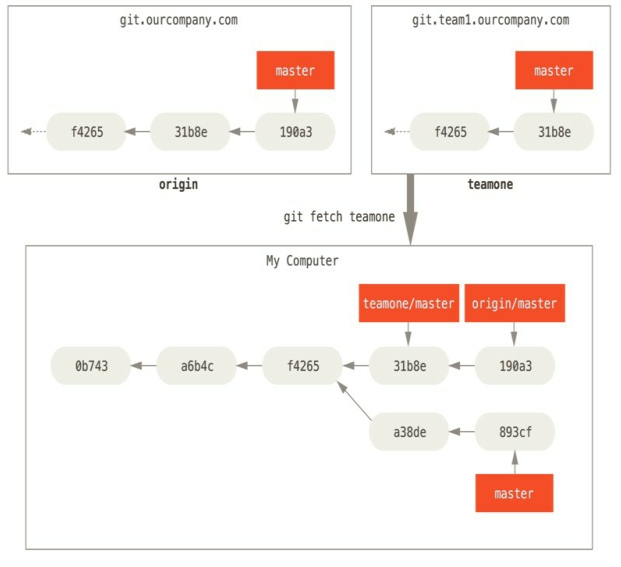

# 第 3 章 Git分支

## 分支简介  

>Git 的分支实质上仅是包含所指对象校验和（长度为 40 的 SHA-1值字符串） 的文件  

> 在进行提交操作时， Git 会保存一个提交对象（commit object) ——该提交对象会包含一个指向暂存内容快照的指针。  还包含了作者的姓名和邮箱、 提交时输入的信息以及指向它的父对象的指针  。

>首次提交产生的提交对象没有父对象， 普通提交操作产生的提交对象有一个父对象， 而由多个分支合并产生的提交对象有多个父对象  。

三个将要被暂存和提交的文件  

```bash
$ git add README test.rb LICENSE
```

> 暂存操作会为每一个文件计算校验和  ， 然后会把当前版本的文件快照保存到 Git 仓库中 (blob 对象  ) 。
>
> 将校验和加入到暂存区域等待提交。  

```bash
$ git commit -m 'The initial commit of my project'
```

>`git commit`: Git 会先计算每一个子目录（本例中只有项目根目录） 的校验和， 然后在 Git 仓库中这些校验和保存为树对象。 随后， Git 便会创建一个提交对象， 它除了包含上面提到的那些信息外， 还包含指向这个树对象（项目根目录） 的指针。   

Git 仓库中有五个对象：   三个 blob 对象（保存着文件快照） 、 一个树对象（记录着目录结构和 blob 对象索引） 以及一个提交对象（包含着指向前述树对象的指针和所有提交信息)。


做些修改后再次提交， 那么这次产生的提交对象会包含一个指向上次提交对象（父对象） 的指针。  


> Git 的分支， 其实本质上仅仅是指向提交对象的可变指针。  在多次提交操作之后， 你其实已经有一个指向最后那个提交对象的 master 分支。 它会在每次的提交操作中自动向前移动。  


---

### 分支创建

创建了一个可以移动的新的指针。  

```bash
$ git branch testing
```


`HEAD` 是当前分支引用的指针，它总是指向某次commit，默认是上一次的commit。

---

### 分支切换

```bash
$ git checkout testing
```


```bash
$ git commit -a -m 'made a change'
```


```bash
$ git checkout master
```


>一是使 HEAD 指回 master 分支， 二是将工作目录恢复成 master 分支所指向的快照内容。   

>现在做修改的话， 项目将始于一个较旧的版本。忽略 testing 分支所做的修改， 以便于向另一个方向进行开发。    

创建了一个新分支， 并切换过去进行了一些工作， 随后又切换回 master 分支进行了另外一些工作。  


输出你的提交历史、 各个分支的指向以及项目的分支分叉情况  

```bash
$ git log --oneline --decorate --graph --all
* c2b9e (HEAD, master) made other changes
| * 87ab2 (testing) made a change
|/
* f30ab add feature #32 - ability to add new formats to the
* 34ac2 fixed bug #1328 - stack overflow under certain conditions
* 98ca9 initial commit of my project
```

## 分支的新建与合并  

实际工作中你可能
会用到类似的工作流。 你将经历如下步骤：

1. 开发某个网站。 

2. 为实现某个新的需求， 

3. 创建一个分支。在这个分支上开展工作。


正在此时， 你突然接到一个电话说有个很严重的问题需要紧急修补。你将按照如下方式来处理：

1. 切换到你的线上分支（production branch） 。

2. 为这个紧急任务新建一个分支， 并在其中修复它。

3. 在测试通过之后， 切换回线上分支， 然后合并这个修补分支， 最后将改动推送到线上分支。

4.  切换回你最初工作的分支上， 继续工作。  

### 新建分支  

 

```bash
$ git checkout -b iss53
```

> 等价

```bash
$ git branch iss53
$ git checkout iss53
```


```bash
$ vim index.html
$ git commit -a -m 'added a new footer [issue 53]'
```


>工作目录和暂存区里那些还没有被提交的修改， 它可能会和你即将检出的分支产生冲突从而阻止 Git 切换到该分支。在你切换分支之前， 保持好一个干净的状态，有一些方法可以绕过这个问题（即， 保存进度（stashing） 和 修补提交（commit amending） ）  

>换分支的时候， Git 会重置你的工作目录， 使其看起来像回到了你在那个分支上最后一次提交的样子。 Git 会自动添加、 删除、 修改文件以确保此时你的工作目录和这个分支最后一次提交时的样子一模一样。  

```bash
$ git checkout -b hotfix
Switched to a new branch 'hotfix'
$ vim index.html
$ git commit -a -m 'fixed the broken email address'
[hotfix 1fb7853] fixed the broken email address
1 file changed, 2 insertions(+)$ git checkout -b hotfix
```


合并回master 分支来部署到线上  

```bash
$ git checkout master
$ git merge hotfix
Updating f42c576..3a0874cFast-forward
index.html | 2 ++
1 file changed, 2 insertions(+)
```

>如果顺着一个分支走下去能够到达另一个分支， 那么 Git在合并两者的时候， 只会简单的将指针向前推进（指针右移） ， 因为这种情况下的合并操作没有需要解决的分歧——这就叫做 “快进（`fastforward`） ”  


删除 hotfix 分支  

```bash
$ git branch -d hotfix
```

切换回正在工作的分支继续的工作  

```bash
$ git checkout iss53
```


>在 hotfix 分支上所做的工作并没有包含到 iss53 分支中。 如果你需要拉取 hotfix 所做的修改， 你可以使用 git merge master 命令将 master分支合并入 iss53 分支， 或者你也可以等到 iss53 分支完成其使命， 再将其合并回 master 分支。  

---

### 分支的合并

合并 iss53 分支到 master 分支  

```bash
$ git checkout master
Switched to branch 'master'
$ git merge iss53
Merge made by the 'recursive' strategy.
index.html | 1 +
1 file changed, 1 insertion(+)
```

>区别于`hotfix` , master 分支所在提交并不是 iss53 分支所在提交的直接祖先  , Git 会使用两个分支的末端所指的快照（ C4 和 C5 ） 以及这两个分支的工作祖先（ C2） ， 做一个简单的三方合并。  


>和之间将分支指针向前推进所不同的是， Git 将此次三方合并的结果做了一个新的快照并且自动创建一个新的提交指向它。 这个被称作一次合并提交， 它的特别之处在于他有不止一个父提交。  


>Git 会自行决定选取哪一个提交作为最优的共同祖先，并以此作为合并的基础 ;

删除  `iss53`

```bash
$ git branch -d iss53
```

---

###  遇到冲突时的分支合并  

>在两个不同的分支中， 对同一个文件的同一个部分进行了不同的修改， Git 就没法干净的合并它们。  

```bash
$ git merge iss53
Auto-merging index.html
CONFLICT (content): Merge conflict in index.html
Automatic merge failed; fix conflicts and then commit the result.
```

> 没有自动地创建一个新的合并提交  ,等待解决合并产生的冲突, 使用 `git status` 命令来查看那些因包含合并冲突而处于未合并（`unmerged`） 状态的文件  

```bash
$ git status
On branch master
You have unmerged paths.
(fix conflicts and run "git commit")
Unmerged paths:
(use "git add <file>..." to mark resolution)both modified: index.html
no changes added to commit (use "git add" and/or "git commit -a")
```

```html
<<<<<<< HEAD:index.html
<div id="footer">contact : email.support@github.com</div>
=======
<div id="footer">
please contact us at support@github.com
</div>
>>>>>>> iss53:index.html
```

替换成

```html
<div id= "footer" >
please contact us at email.support@github.com
</div>
```

> 对每个文件使用 git add 命令来将其标记为冲突已解决  

图形化工具来解决冲突  

```bash
$ git mergetool
This message is displayed because 'merge.tool' is not configured.
See 'git mergetool --tool-help' or 'git help config' for more details.
'git mergetool' will now attempt to use one of the following tools:
opendiff kdiff3 tkdiff xxdiff meld tortoisemerge gvimdiff diffuse diffmerge ecmerge p4merge araxis
Merging:
index.html
Normal merge conflict for 'index.html':
{local}: modified file
{remote}: modified file
Hit return to start merge resolution tool (opendiff):
```

> 退出合并工具之后， Git 会询问刚才的合并是否成功  

默认情况下提交信息：  

```bash
Merge branch 'iss53'
Conflicts:
index.html
# #
It looks like you may be committing a merge.
# If this is not correct, please remove the file
# .git/MERGE_HEAD
# and try again.
# Please enter the commit message for your changes. Lines starting
# with '#' will be ignored, and an empty message aborts the commit.
# On branch master
# All conflicts fixed but you are still merging.
# #
Changes to be committed:
# modified: index.html
#如果你觉得上述的信息不够充分， 不能完全体现分支合并的过程， 
```

---

## 分支管理  

查看每一个分支的最后一次提交  

```bash
$ git branch -v
```

>--merged 与 --no-merged 这两个有用的选项可以过滤这个列表中已经合并或尚未合并到当前分支的分支  

```bash
$ git branch --merged
```

```bash
$ git branch --no-merged
```

>包含了还未合并的工作， 尝试使用 `git branch -d` 命令删除它时会失败  

删除

```bash
$ git branch -d testing
```
选项强制删除

  ```bash
  $ git branch -D testing
  ```

---

## 分支开发工作流  

### 长期分支  

>许多使用 Git 的开发者都喜欢使用这种方式来工作， 比如只在 master 分支上保留完全稳定的代码——有可能仅仅是已经发布或即将发布的代码。 他们还有一些名为 develop 或者 next 的平行分支， 被用来做后续开发或者测试稳定性——这些分支不必保持绝对稳定， 但是一旦达到稳定状态， 它们就可以被合并入 master 分支了。 


### 特性分支  

>特性分支是一种短期分支， 它被用来实现单一特性或其相关工作。  

>在 master 分支上工作到 C1 ， 这时为了解决一个问题而新建 iss91 分支， 在 iss91 分支上工作到 C4 ， 然而对于那个问题你又有了新的想法， 于是你再新建一个 iss91v2 分支试图用另一种方法解决那个问题， 接着你回到 master 分支工作了一会儿， 你又冒出了一个不太确定的想法， 你便在 C10 的时候新建一个 `dumbidea` 分支， 并在上面做些实验。   


`dumbidea  ` 和 `iss91v2  `


---

## 远程分支  

> _远程引用_ 是对远程仓库的引用（指针） ， 包括分支、 标签等等。  

来显式地获得远程引用的完整列表  

```bash
$ git ls-remote (remote)
```

获得远程分支的更多信息  

```bash
$ git remote show (remote)
```

> 远程跟踪分支是远程分支状态的引用 , 不能移动的本地引用， 当你做任何网络通信操作时， 它们会自动移动。  

>如果你从这里克隆， Git 的clone 命令会为你自动将其命名为 origin ， 拉取它的所有数据， 创建一个指向它的 master 分支的指针， 并且在本地将其命名为 origin/master 。Git 也会给你一个与 origin 的 master 分支在指向同一个地方的本地master 分支  。


>`master` 是当你运行 `git init `时默认的起始分支名字，原因仅仅是它的广泛使用， 
>
>`origin` 是当你运行 `git clone` 时默认的远程仓库名字。  
>
>运行 `git clone -o booyah` ， 那么你默认的远程分支名字将会是 `booyah/master`  

>如果在本地的 master 分支做了一些工作， 然而在同一时间， 其他人推送提交到 git.ourcompany.com 并更新了它的 master 分支， 那么提交历史将向不同的方向前进。  


> 同步工作 

```bash
$ git fetch origin
```


---


>因为`teamone`服务器上现有的数据是 `origin` 服务器上的一个子集， 所以 Git 并不会抓取数据而是会设置远程跟踪分支 `teamone/master` 指向 `teamone` 的 `master` 分支。



### 推送  

>本地的分支并不会自动与远程仓库同步 - 你必须显式地推送想要分享的分支。   

和别人一起在名为 `serverfix` 的分支上工作, `git push (remote) (branch)  `

```bash
$ git push origin serverfix
```

  >Git 自动将 `serverfix` 分支名字展开为`refs/heads/serverfix:refs/heads/serverfix `  

等价, 推送本地的 serverfix 分支来更新 (_创建_) 远程仓库上的 serverfix 分支  

```bash
$ git push origin serverfix:serverfix
```
> 推送的时候会自动创建远程分支，删除本地再推送不会自动删除远程分支，需手动删除远程和本地的分支

其他分支

```bash
$ git push origin serverfix:awesomebranch
```

>使用 `HTTPS URL` 来推送， `Git` 服务器会询问用户名与密码  

可以设置一个`credential cache''。 将其保存在内存中几分钟

```bash
$ git config --global credential.helper cache
```

>当抓取到新的远程跟踪分支时， 本地不会自动生成一份可编辑的副本（拷贝） 。 换一句话说， 这种情况下， 不会有一个新的 `serverfix` 分支 - 只有一个不可以修改的 `origin/serverfix `指针。  

将工作合并到当前所在的分支  

```bash
$ git merge origin/serverfix 
```

想要在自己的 `serverfix` 分支上工作， 可以将其建立在远程跟踪分支之上：  

```bash
$ git checkout -b serverfix origin/serverfix
```

给出一个用于工作的本地分支， 并且起点位于 `origin/serverfix `

### 跟踪分支  

>从一个远程跟踪分支检出一个本地分支会自动创建一个叫做 跟踪分支''（有时候也叫做 上游分支''） 。 跟踪分支是与远程分支有直接关系的本地分支。 如果在一个跟踪分支上输入 git pull ， Git 能自动地识别去哪个服务器上抓取、 合并到哪个分支。  

>当克隆一个仓库时， 它通常会自动地创建一个跟踪 `origin/master` 的`master `分支  

跟踪分支

`git checkout -b [branch] [remotename]/[branch]  `

快捷方式

```bash
$ git checkout --track origin/serverfix
```

将本地分支与远程分支设置为不同名字  

```bash
$ git checkout -b sf origin/serverfix
```

设置已有的本地分支跟踪一个刚刚拉取下来的远程分支， 或者想要修改正在跟踪的上游分支 ;

可以在任意时间使用 -u 或 --set-upstream-to 选项运行 git branch 来显式地设置  

```bash
$ git branch -u origin/serverfix
```

```bash
$ git branch --set-upstream-to origin/serverfix
```

当设置好跟踪分支后， 可以通过 @{upstream} 或 @{u} 快捷方式来引用它。  

```bash
git merge @{u}
```

等价

```bash
git merge origin/master
```

查看设置的所有跟踪分支  

```bash
$ git branch -vv
iss53 7e424c3 [origin/iss53: ahead 2] forgot the brackets
master 1ae2a45 [origin/master] deploying index fix
* serverfix f8674d9 [teamone/server-fixgood: ahead 3, behind 1] this should do it
testing 5ea463a trying something new
```

> 将所有的本地分支列出来并且包含更多的信息 , 如每一个分支正在跟踪哪个远程分支与本地分支是否是领先、 落后或是都有。  

> 1. `ss53` 分支正在跟踪 `origin/iss53` 并且 `ahead` 是 `2`， 意味着本地有两个提交还没有推送到服务器上 .
>
> 2. `master` 分支正在跟踪 `origin/master` 分支并且是最新的.
> 3. `serverfix` 分支正在跟踪` teamone` 服务器上的` server-fix-good` 分支并且领先 `2` 落后` 1`， 意味着服务器上有一次提交还没有合并入同时本地有三次提交还没有推送 .
> 4. `testing` 分支并没有跟踪任何远程分支  

>这个命令并没有连接服务器， 它只会告诉你关于本地缓存的服务器数据。 如果想要统计最新的领先与落后数字， 需要在运行此命令前抓取所有的远程仓库  

```bash
$ git fetch --all; git branch -vv
```

### 拉取

>当 git fetch 命令从服务器上抓取本地没有的数据时， 它并不会修改工作目录中的内容  

`git pull  `  =  `git fetch   `+ `git merge  `

>git pull 会查找当前分支所跟踪的服务器与分支， 从服务器上抓取数据然后尝试合并入那个远程分支  

### 删除远程分支  

从服务器上删除 `serverfix `分支  

```bash
$ git push origin --delete serverfix
```

>Git 服务器通常会保留数据一段时间直到垃圾回收运行  

---

## 变基  

> Git 中整合来自不同分支的修改主要有两种方法： merge 以及 rebase  

### 变基的基本操作  

问题：开发任务分叉到两个不同分支， 又各自提交了更新  


**方法一**：`merge  `: 把两个分支的最新快照（ C3 和 C4 ） 以及二者最近的共同祖先（ C2 ） 进行三方合并， 合并的结果是生成一个新的快照（并提交）   


**方法二**：提取在 C4 中引入的补丁和修改， 然后在C3 的基础上再应用一次。

**_变基_**   

> 使用` rebase` 命令将提交到某一分支上的所有修改都移至另一分支上  

```bash
$ git checkout experiment
$ git rebase master
First, rewinding head to replay your work on top of it...
Applying: added staged command
```

>原理是首先找到这两个分支（即当前分支 experiment 、 变基操作的目标基底分支 master ） 的最近共同祖先 C2 ， 然后对比当前分支相对于该祖先的历次提交， 提取相应的修改并存为临时文件， 然后将当前分支指向目标基底 C3 , 最后以此将之前另存为临时文件的修改依序应用。  


回到 `master` 分支， 进行一次快进合并  

```bash
$ git checkout master
$ git merge experiment
```


>这两种整合方法的最终结果没有任何区别， 但是变基使得提交历史更加整洁。 你在查看一个经过变基的分支的历史记录时会发现， 尽管实际的开发工作是并行的， 但它们看上去就像是先后串行的一样， 提交历史是一条直线没有分叉  

>的是为了确保在向远程分支推送时能保持提交历史的整洁  

>首先在自己的分支里进行开发， 当开发完成时你需要先将你的代码变基到 origin/master 上， 然后再向主项目提交修改。 这样的话， 该项目的维护者就不再需要进行整合工作， 只需要快进合并便可。  

>变基是将一系列提交按照原有次序依次应用到另一分支上， 而合并是把最终结果合在一起。  

### 更有趣的变基例子

>创建了一个特性分支 server ， 为服务端添加了一些功能， 提交了 C3 和 C4 。 然后从 C3上创建了特性分支 client ， 为客户端添加了一些功能， 提交了 C8 和C9 。 最后， 你回到 server 分支， 又提交了 C10 


>将 client 中的修改合并到主分支并发布， 但暂时并不想合并 server 中的修改， 因为它们还需要经过更全面的测试 

```bash
$ git rebase --onto master server client
```

>选中在 client 分支里但不在server 分支里的修改（即 C8 和 C9 ） ， 将它们在 master 分支上重演  

